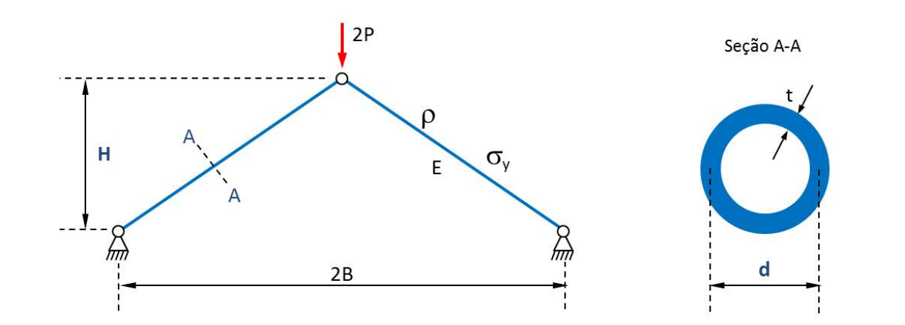
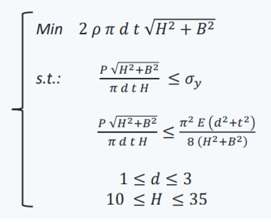
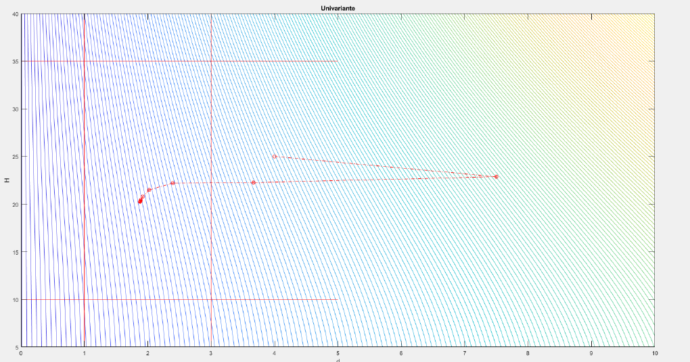
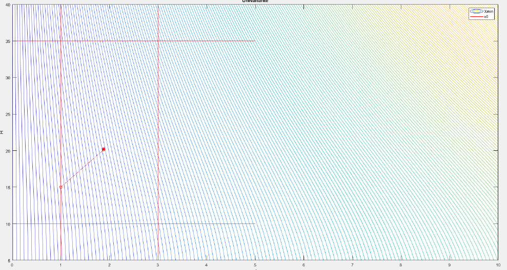

# Otimização: Algoritmos e Aplicações na Engenharia Mecânica

## Trabalho Desenvolvido para disciplina MEC2403 | PUC-RIO

## Problema Proposto

### Utilizar métodos indiretos para minimizar o peso da treliça plana de duas barras.

As variáveis de projeto são o diâmetro médio da seção transversal das barras (d) e a altura da treliça (H). 

São conhecidos:
- peso específico (ρ)
- dimensão horizontal (B)
- espessura da seção (t)
- módulo de elasticidade do material (E)

Restrições:
As tensões nas barras da treliça não devem superar o valor da tensão de escoamento do material (σy) e a tensão crítica de Euler.

### Métodos indiretos:
##### - Método da Barreira
##### - Método da Penalidade

### Métodos de Definição de direção:
##### Univariante
##### Powell
##### Gradiente Descendente
##### Fletcher-Reeves
##### BFGS
##### Newton-Raphson

### Métodos de Busca Linear:
#### Seção Áurea

Foram desenvolvidos códigos em MATLAB para determinação de que minimiza uma função dada restrições

## Resultados:

### Barreira
Ponto de Mínimo [d, H] = [1.87848  20.23889]

### Penalidade
Ponto de Mínimo [d, H] = [1.87836  20.23676]

